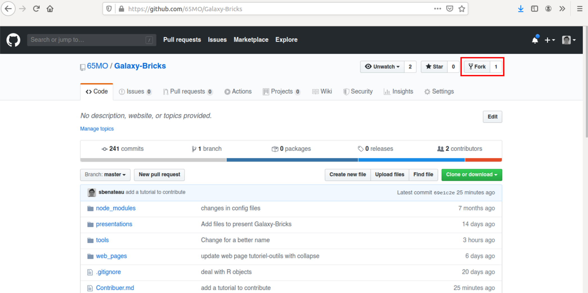

# Comment contribuer à Galaxy-Bricks

## Créer une branche sur GitHub

Rendez-vous sur l'adresse du dépôt 

Clickez sur Fork (dans le coin supérieur droit)  

Puis clickez sur votre nom d'utilisateur  

Maintenant le dépôt est sur votre compte personnel.

## Cloner le dossier sur l'ordi

Maintenant sur **votre** répertoire, cloner le dépôt.

add image

Vous pouvez utiliser Atom par exemple ou en ligne de commande : `git clone https://github.com/username/Galaxy-Bricks.git`

## Faire les modifications

Utiliser votre éditeur de texte pour faire les modifications dans le dépôt.

Une fois que vous avez terminé des changements, vous pouvez faire un "commit".

`git add contribuer.md`
`git commit -m modifications du tutoriel pour contribuer`

## Pousser les modifications sur GitHub

## Ouvrir une "pull request"
